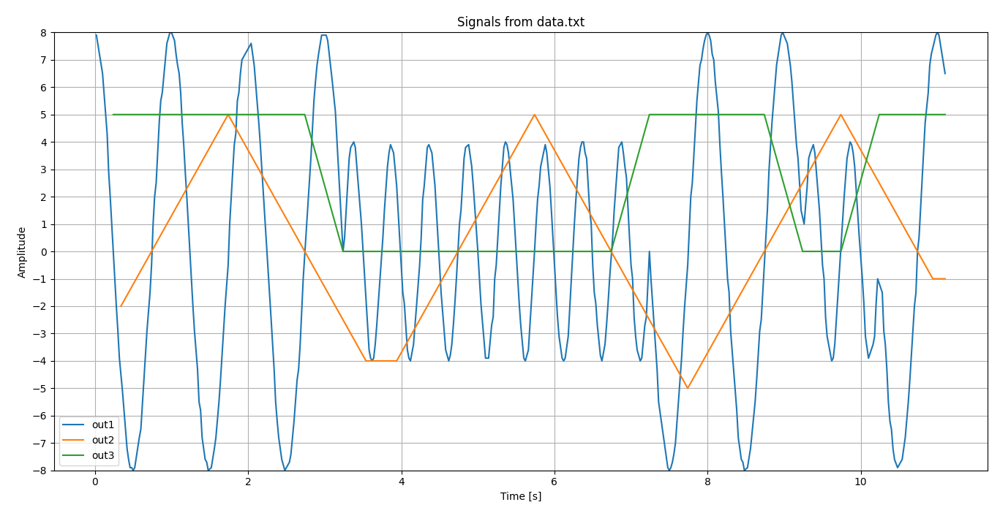
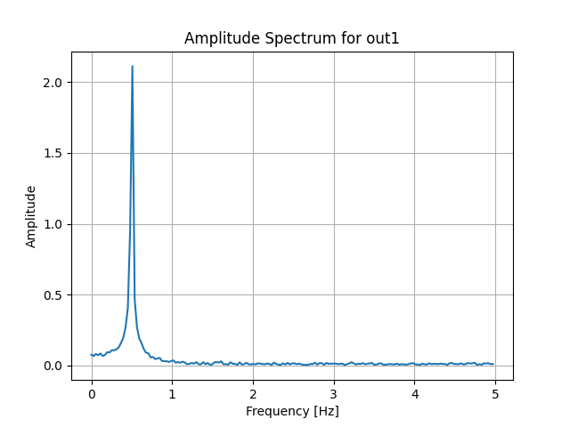
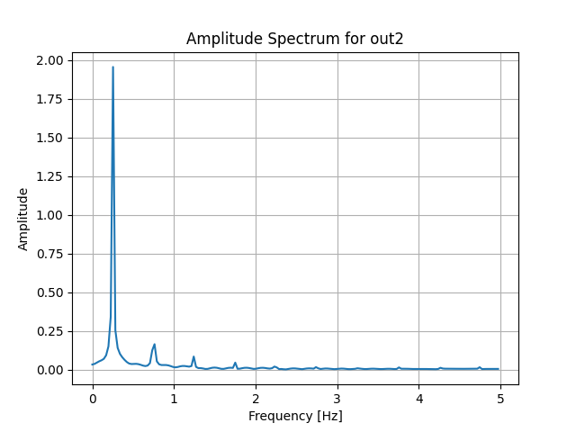
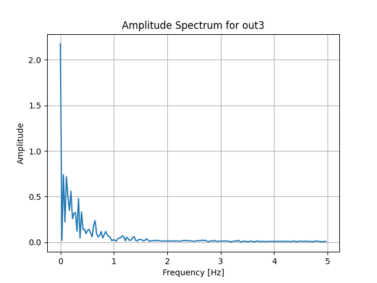

# Client–Server Signal Characterization Project

This project was developed to establish and test the client–server communication pipeline, characterize transmitted signals, and validate control mappings for frequency and amplitude.

---

## 🚀 Initial Setup

Initially, a snippet of the client application was implemented to:
- Start a connection with the server. (Podman was used instead of docker to avoid root priviliges and generate a safe working environment)
- Verify the communication pipeline.
- Measure request/reply timing and responsiveness.

In parallel, I began developing several auxiliary tools to characterize the signals being exchanged.  
Signal characterization was essential to define appropriate time windows based on signal frequency and sampling rate.

---

## 🧩 Communication Protocol Analysis

The communication protocol was not fully specified in the documentation, so I created a helper script,  
`protocol_decode.sh`, to analyze and identify the correct field mappings.

Through this investigation, I determined that:
- **Frequency** values are mapped such that `1000 → 1 Hz`.
- **Amplitude** values map directly without scaling.

---

## ⚙️ Client Design and Architecture

After analyzing timing margins and expected response behavior, I implemented a two-threaded design:
- One **writer** thread for sending commands and printing values.
- One **reader** thread for receiving and processing data.

To ensure data consistency and optimal responsiveness:
- A mutex protects critical sections during shared data access.
- The `select()` system call is used for **non-blocking socket handling**,  
  preventing delays that could disrupt real-time consistency.

This architecture guarantees smooth data flow and predictable timing under varying network conditions.

---

## 📊 Signal Characterization Tools

To verify signal behavior, I added a **Python FFT analysis tool** to inspect the frequency spectrum.  
This served two purposes:

1. **Control Mapping Validation**  
   Using the “post” tool (which performs single write/read commands),  
   I verified that frequency control commands produced the expected spectral shifts.

2. **Signal Type Characterization**  
   - The **sine** signal shows a clear single frequency peak.  
   - The **triangular** and **pulse** signals display expected harmonic decay across odd harmonics.  
   - Additional time-domain plots complement the spectral analysis for a complete view.

---

## ✅ Results and Verification

The system performs as expected:
- Frequency and amplitude commands correctly modify **Signal 1 (out1)**, as observed in both time-domain and FFT plots.
- The server responds with confirmation messages

TIME DOMAIN

FREQUENCY DOMAIN

